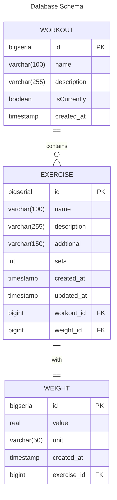

<h1 align="center"> Workout Tracker API </h1>

## :book: Resumo do projeto
Workout Tracker API é uma REST API onde você pode montar o seu treino, verificar progressão de carga ao longo do tempo
e muito mais para auxiliá-lo no seu treinamento e maximizar seus ganhos.

## Diagramas

### :capital_abcd: Diagrama entidade relacionamento

