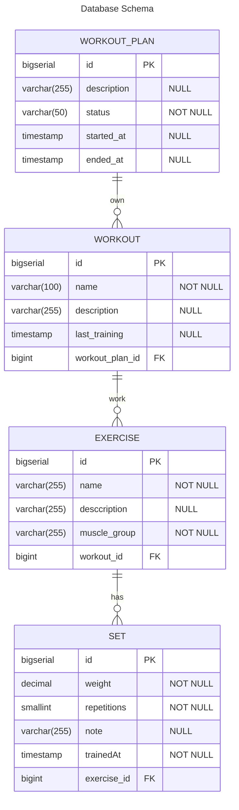

<h1 align="center">Workout Tracker API</h1>

## :book: Resumo do projeto
Workout Tracker API é uma REST API para auxiliar em seu treino na academia, ajudando-o a monitorar a progressão de
carga, salvando as informações de treinos anteriores para fins de comparação.

## :white_large_square: Diagramas

### Diagrama entidade relacionamento

```mermaid
---
    title: Database Schema
---
    erDiagram
        WORKOUT_PLAN {
            bigserial id PK
            varchar(255) description "NULL"
            varchar(50) status "NOT NULL"
            timestamp started_at "NULL"
            timestamp ended_at "NULL"
        }
        WORKOUT {
            bigserial id PK
            varchar(100) name "NOT NULL"
            varchar(255) description "NULL"
            timestamp last_training "NULL"
            bigint workout_plan_id FK 
        }
        EXERCISE {
            bigserial id PK
            varchar(255) name "NOT NULL"
            varchar(255) desccription "NULL"
            varchar(255) muscle_group "NOT NULL"
            bigint workout_id FK
        }
        SET {
            bigserial id PK
            decimal weight "NOT NULL"
            smallint repetitions "NOT NULL"
            varchar(255) note "NULL"
            timestamp trainedAt "NOT NULL"
            bigint exercise_id FK
        }
        WORKOUT_PLAN ||--o{ WORKOUT : own
        WORKOUT ||--o{ EXERCISE : work
        EXERCISE ||--o{ SET : has
```